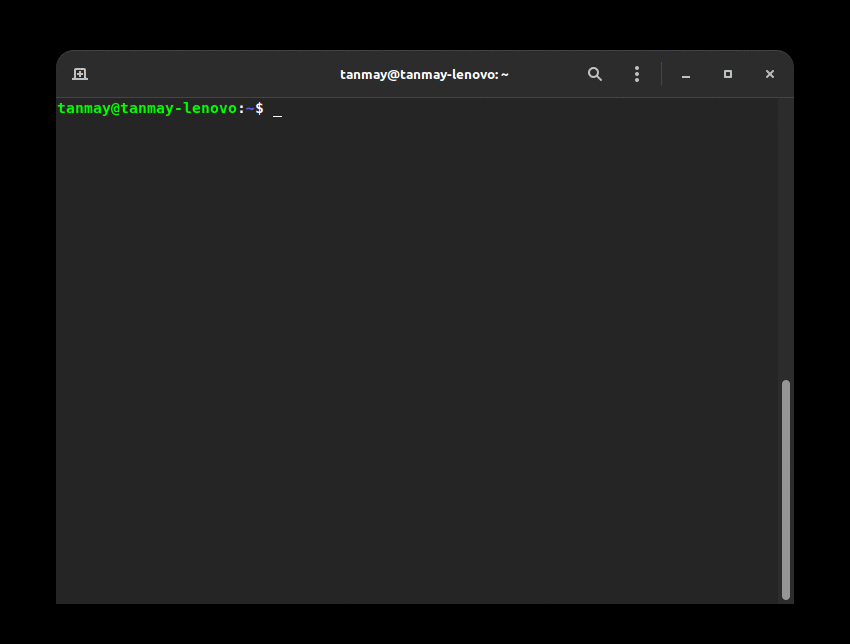

# procfetch [](https://codecov.io/gh/TanmayPatil105/procfetch)

#### procfetch is a command-line tool to fetch system information and display it on the screen. 
#### It is written in `C++`. 
#### Project inspiration : `neofetch` - a command line system information tool

### Information displayed by procfetch
#### Static characteristics

* Host (User)
* CPU
* Kernel
* OS
* Shell
* Desktop Enviroment
* Resolution
* Theme
* Icons
* GPU (Integrated & Dedicated)
* Package count

#### Dynamic characteristics
* RAM
* Uptime
* Temperature

## Prerequisites

* GNU Make

## Installation

```
$ git clone https://github.com/TanmayPatil105/procfetch.git
 ```

```
$ cd procfetch
```

```
$ chmod +x install.sh
```
```
$ ./install.sh
```
```
$ sudo chmod +x /usr/bin/procfetch
```
## Uninstallation
```
$ chmod +x uninstall.sh
```
```
$ ./uninstall.sh
```



<hr/>

## Docker

Define environment variable `PROCFETCH` in the actual project home directory.

```sh
$ PROCFETCH=$HOME/procfetch
```

Build Docker image

```sh
$ docker build -t procfetch .
```

Build with Docker container
```sh
$ docker run --rm -v $PROCFETCH:/procfetch -w /procfetch procfetch make
```

Run with Docker container
```sh
$ docker run --rm -v $PROCFETCH:/procfetch -w /procfetch procfetch make run
```

Test with Docker container
```sh
$ docker run --rm -v $PROCFETCH:/procfetch -w /procfetch procfetch make check
```

### Contributing

Make sure reading [Contributing.md](https://github.com/TanmayPatil105/procfetch/blob/main/CONTRIBUTING.md) before Contributing

#### Disclamer :
Tried and tested on Debian, Ubuntu and ParrotOS.

